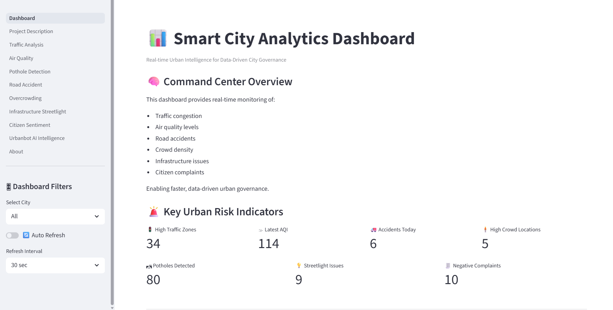
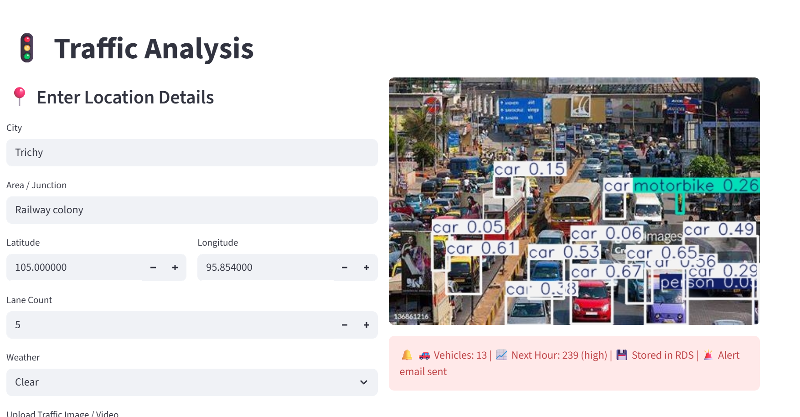
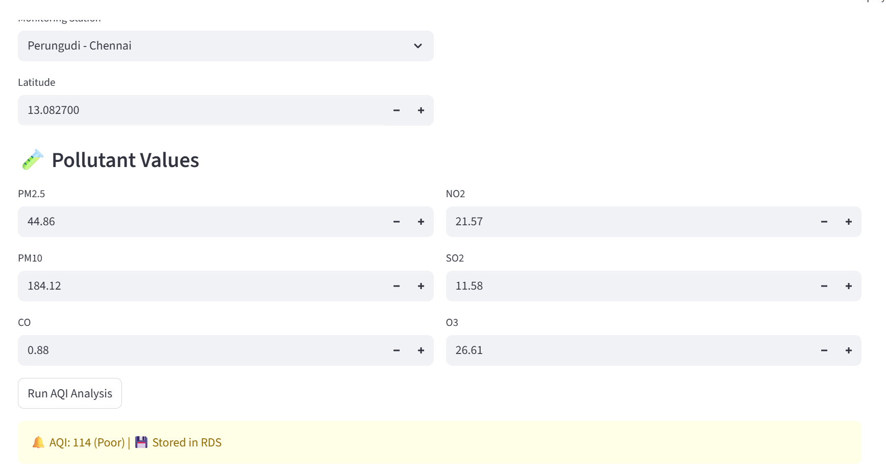
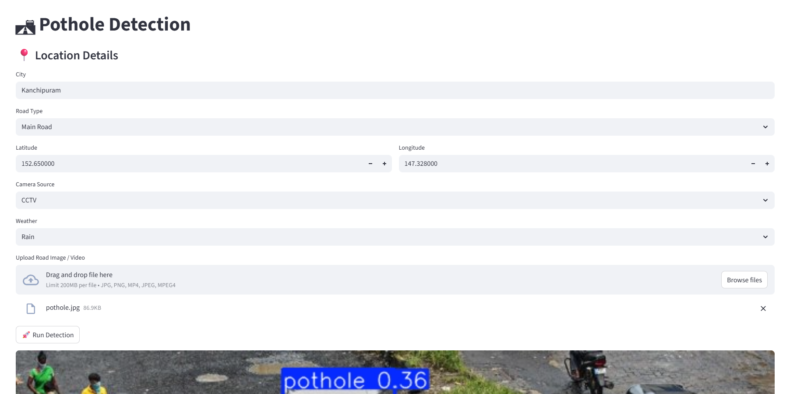
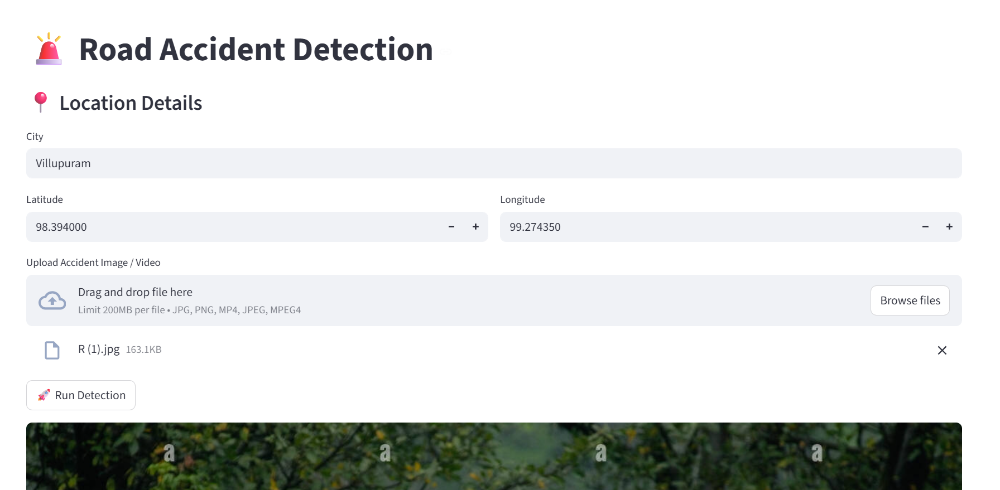
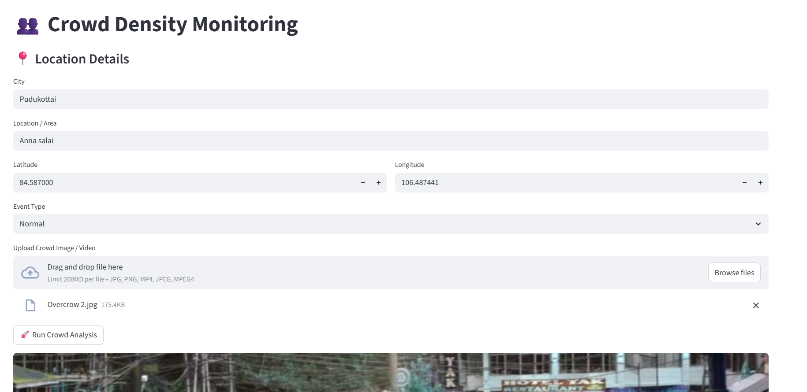
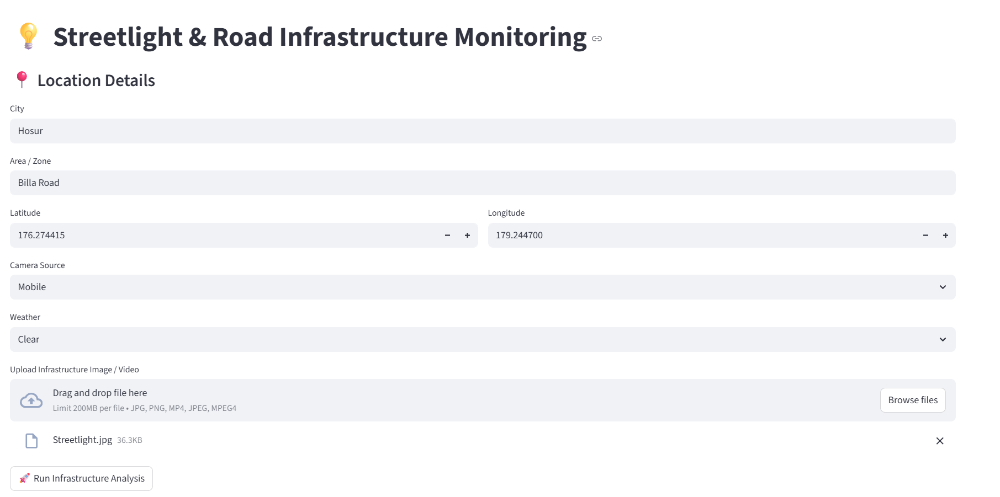

# 🌆 UrbanBot – Smart City Analytics Platform

UrbanBot is an AI-powered Smart City Decision Support System that integrates computer vision, machine learning, natural language processing, real-time analytics, and cloud technologies into a unified intelligent platform for urban monitoring and governance.

The system is designed to assist city authorities in identifying critical events, analysing infrastructure conditions, prioritising citizen issues, and generating operational insights through an interactive AI interface.

---


🌍 Live Deployment

Deployed on AWS EC2
(Cloud URL will be added after deployment)


## 🎯 Project Objective

To build an end-to-end smart city analytics platform that:

- Monitors urban events in real time
- Detects infrastructure and traffic incidents using AI
- Analyses citizen complaints using NLP
- Generates automated alerts and reports
- Provides an LLM-powered decision-support chatbot
- Visualises city-wide intelligence through a command dashboard

---

## 🧠 Core AI Capabilities

- Computer Vision for:
  - 🚨 Road accident detection
  - 🛣 Pothole detection
  - 🧍 Crowd density monitoring
  - 💡 Streetlight & infrastructure analysis

- Natural Language Processing:
  - Citizen complaint sentiment detection
  - Priority classification & department routing

- LLM-powered Smart City Assistant:
  - Natural language database queries
  - AI-generated operational reports
  - Automated email drafting
  - RAG-based knowledge retrieval

---

## 📊 Smart City Command Dashboard

The dashboard acts as the central monitoring interface and provides:

- High traffic zones
- Latest AQI status
- Accidents detected today
- Crowd hotspot locations
- Total potholes detected
- Streetlight infrastructure issues
- High-priority (negative) citizen complaints

It also includes:

- Trend charts
- Hotspot visualisations
- Real-time database-driven KPIs


---

## 🧩 System Modules

### 1️⃣ Traffic Analysis
AI-based congestion detection and city-wise traffic analytics.


### 2️⃣ Air Quality Monitoring
Location-based AQI tracking with category classification.


### 3️⃣ Pothole Detection
YOLO-based road damage detection for infrastructure maintenance.


### 4️⃣ Road Accident Detection
Severity classification:
- Minor
- Moderate
- Major  
Automatic alert generation for critical incidents.


### 5️⃣ Crowd Density Monitoring
High-density area identification for public safety planning.


### 6️⃣ Infrastructure & Streetlight Monitoring
Detection and logging of faulty public infrastructure.


### 7️⃣ Citizen Complaint Intelligence
- Complaint registration
- Sentiment analysis
- Priority detection
- Department mapping


### 8️⃣ UrbanBot AI Intelligence
Multi-agent LLM assistant that can:
- Query city data
- Generate reports
- Draft official emails
- Retrieve knowledge using RAG
- Display latest monitoring images from AWS S3


---

## 🗄️ Database

AWS RDS MySQL is used for:

- Event storage
- AI detection logs
- Complaint records
- System alerts
- RAG knowledge indexing

---

## ☁️ Cloud Integration

- AWS S3 → stores annotated monitoring images
- AWS RDS → central smart city database
- AWS EC2 → application deployment

---

## 🛠️ Technology Stack

Frontend:
- Streamlit

Backend:
- Python

AI / ML:
- YOLOv8 (Ultralytics)
- Scikit-learn
- NLP (Sentiment Analysis)
- LLM + RAG + AI Agents

Database:
- MySQL (AWS RDS)

Cloud:
- AWS S3
- AWS EC2

Visualisation:
- Plotly

---

## ⚙️ Run Locally

```bash
pip install -r requirements.txt
streamlit run 1_Dashboard.py